# Introducción a Neo4J y Cypher

Curso impartido por [*Charlotte Skardon*](https://www.linkedin.com/in/cskardon/?originalSubdomain=uk) y [*Romain Dumaine*](https://www.linkedin.com/in/romaindumaine-neo4j/?originalSubdomain=uk).

---

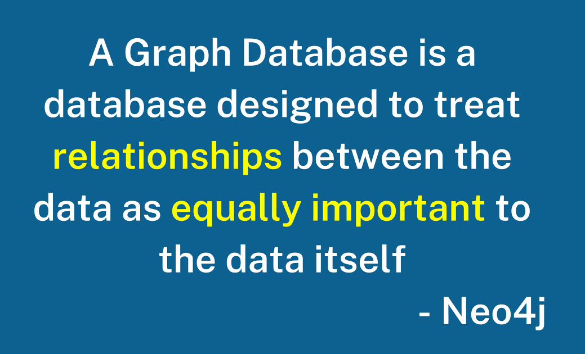

## Todo puede ser un grafo
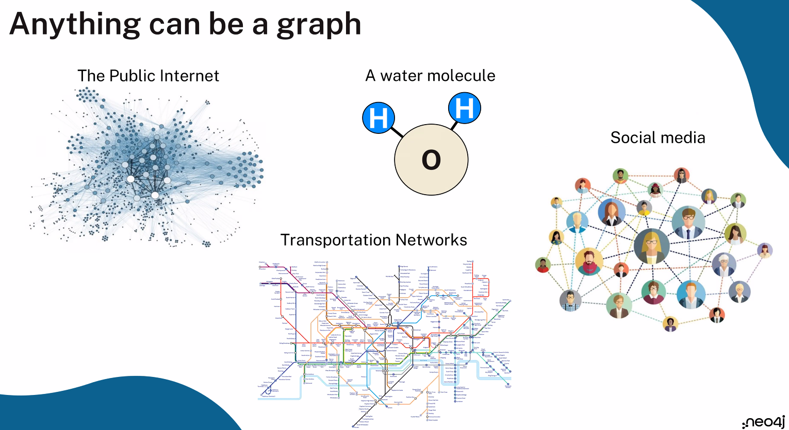

---

## Conexiones
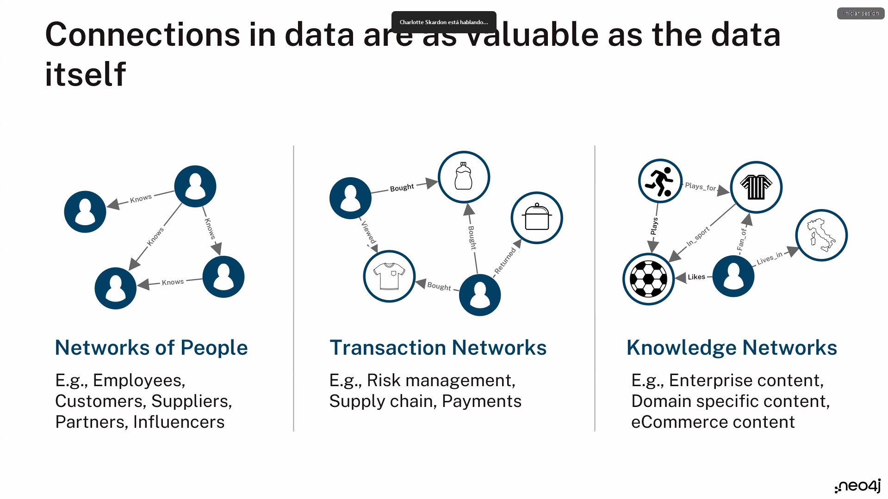

---

### Neo4j is the clear maket leader in the graph space.
It has the most users, it uses and drives a widely adopted query language. In many respects, it has consistenly been a lot more innovate than its competitors.

Neo4j is a database - ACID

- Atomicity, Consistecy, Isolation, Durability
- A transaction succeeds as a whole or fails as a whole
- This idfferentiates Neo4j from other graph database - and NOSQL vendors
- Neo4j offers the same guarantees as an Oracle, SQL*Server...

Neo4j is a datbaase - Secret ingredient(s)

- Graph Native
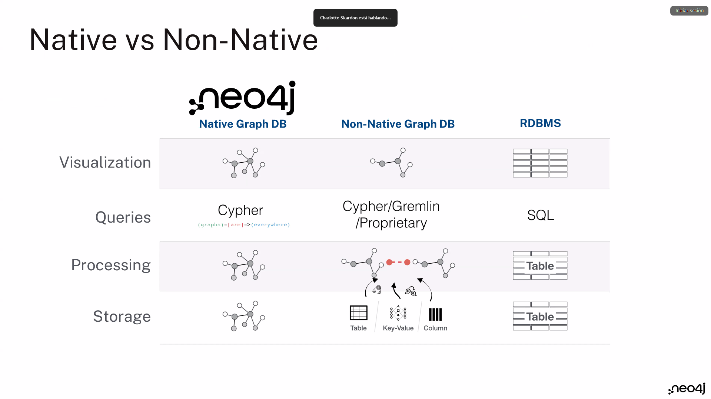
- Index Free Adjacency
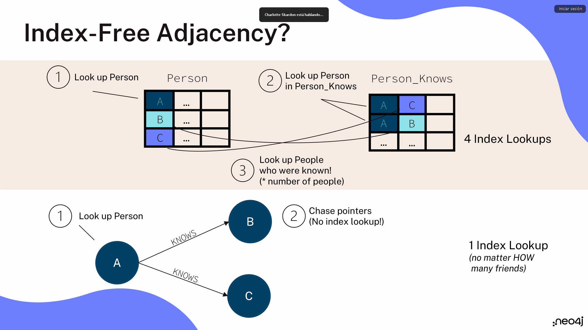
- Graph Locality
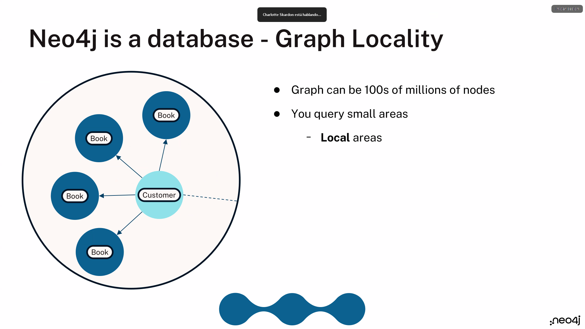

## Ecosistema
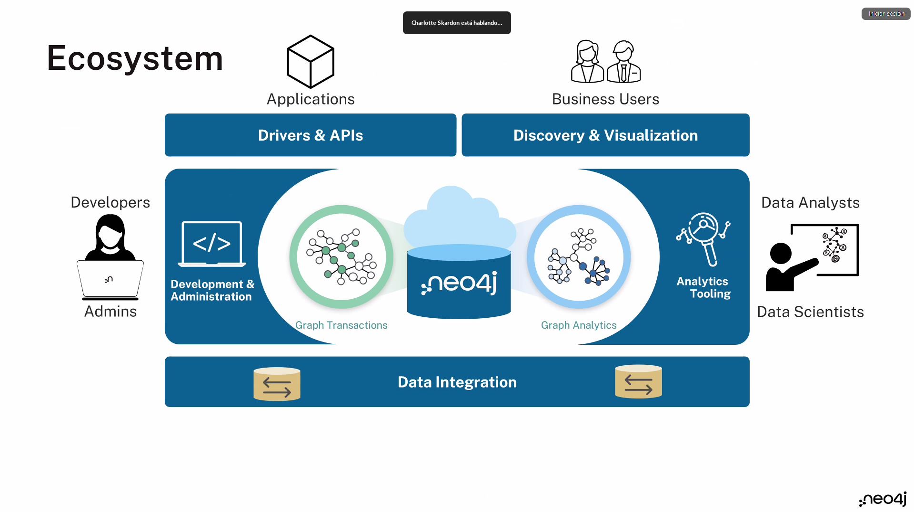

---

## Graph components
**Node (Vertex)**
- The main data element from which graphs are constructed

**Relationship (Edge)**
- A link betwee two nodes
    - Direction
    - Type

**Label**
-   Define node role (optional)
-   Can have more than one

**Properties**
-   Enrich
    -   nodes
    -   relationships
-   No need for nulls

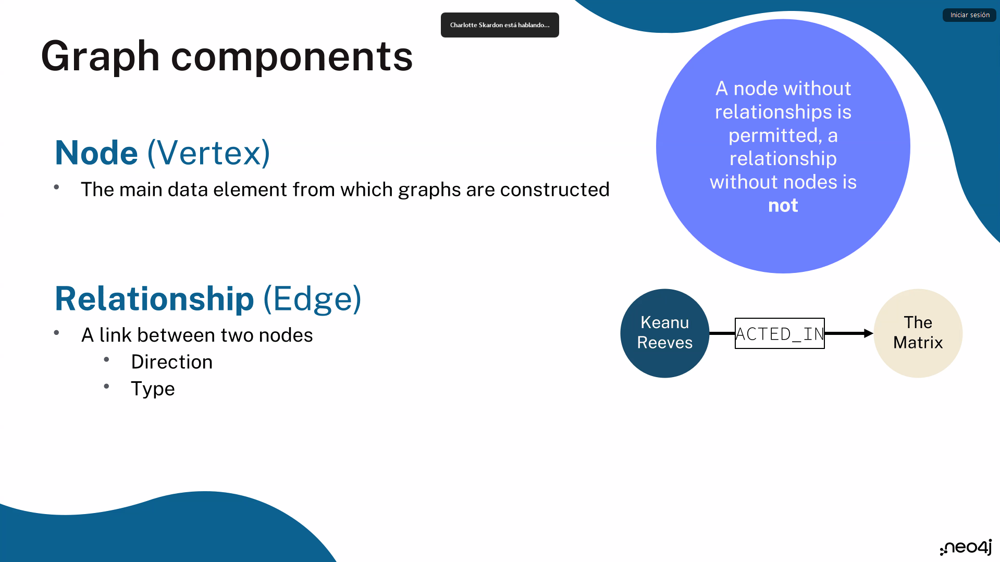

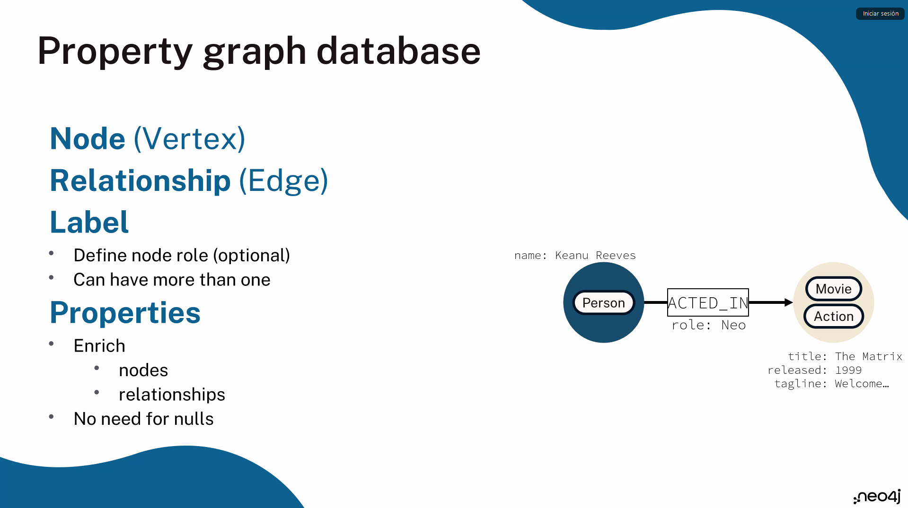

## What is Cypher?

- A declarative query langauge for property graphs
- Uses a (limited) form of ASCII Art to allow you to visually describe the patterns in the graph. 

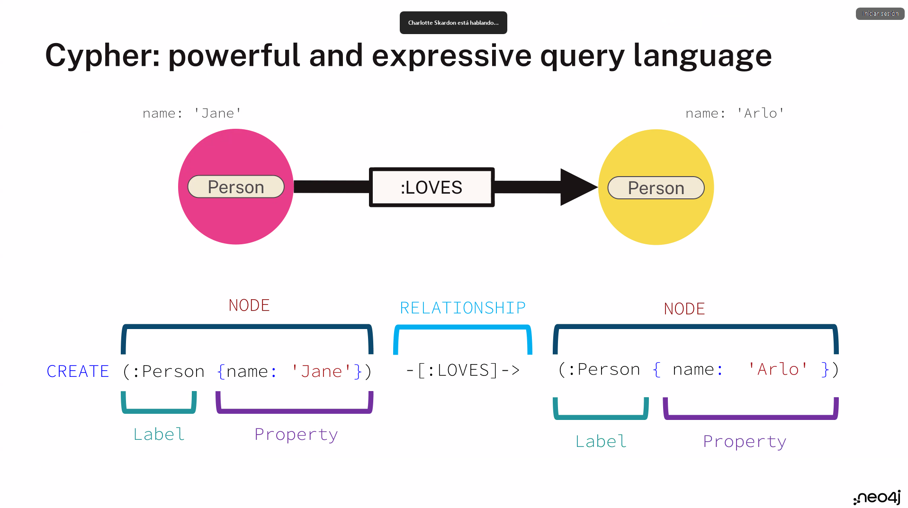
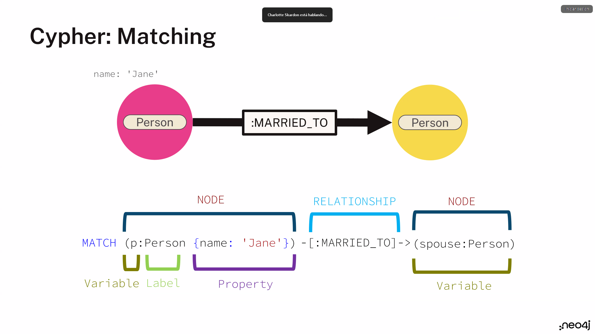

## Where is Cypher going?

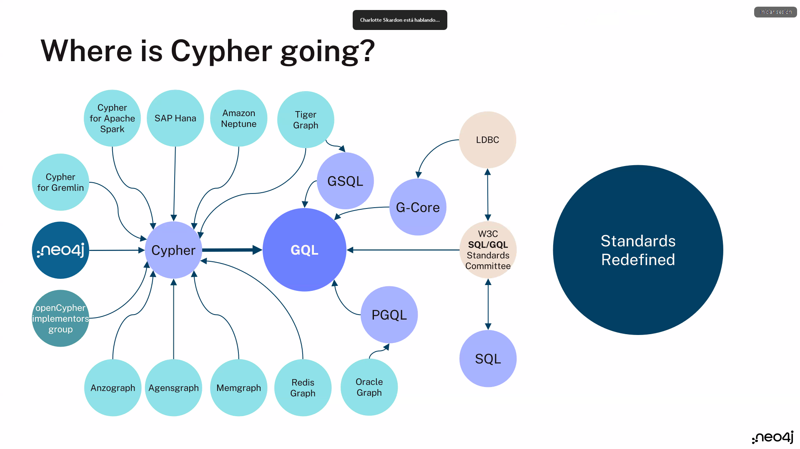

---

## What about GraphQL?

**GQL != GraphQL**
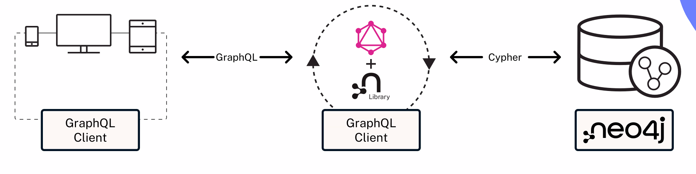

---
[Acceso a la instancia de Neo4j Aura](https://console-preview.neo4j.io/tools/query)